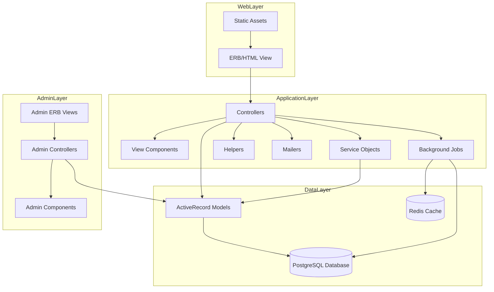
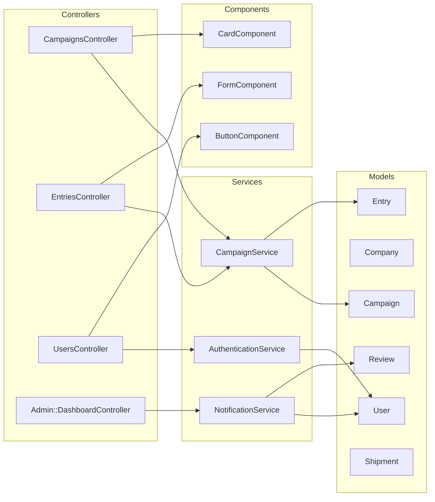
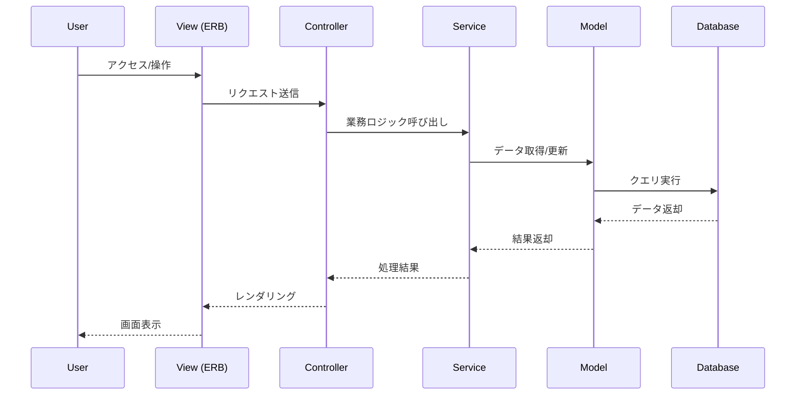
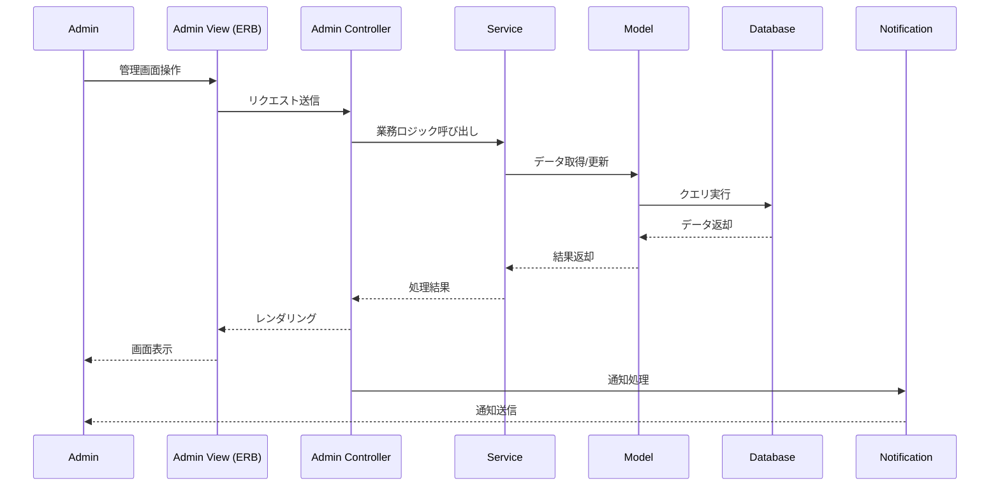
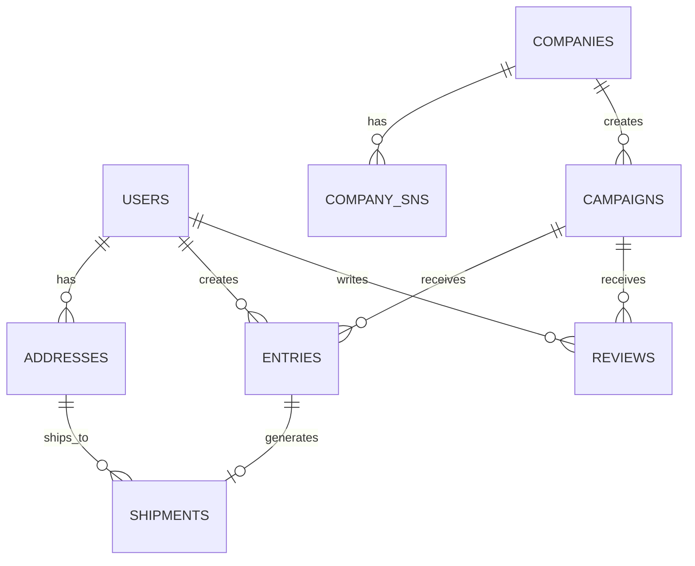

# Obebibo System Architecture（Rails 単一構成）

## High-Level Architecture

---

## Component Architecture

### Rails Application Components

---

## Data Flow Architecture

### User Application Flow

### Admin Management Flow

---

## Security Architecture

### Authentication & Authorization

- Devise による認証（ユーザ・管理者分離）
- 権限管理（管理者/一般ユーザ）
- CSRF/XSS/SQL インジェクション対策
- エラーハンドリング・ロギング

---

## Database Architecture

### Entity Relationship Diagram

---

## Deployment Architecture

- Docker Compose による Rails+PostgreSQL+Redis 構成
- .env で環境変数管理
- 本番/開発環境の分離
- 静的ファイルは public/で管理

---

## Performance & Security

- DB インデックス設計
- Redis キャッシュ活用
- N+1 防止・クエリ最適化
- ログ・監査・個人情報マスキング
- HTTPS/セキュリティヘッダー
- 権限管理・認証/認可

---

このアーキテクチャは Rails 単体で「見た目」と「データ」を分離しつつ、管理者/ユーザ画面・API・業務ロジック・セキュリティ・運用まで一貫して設計できる構成です。
