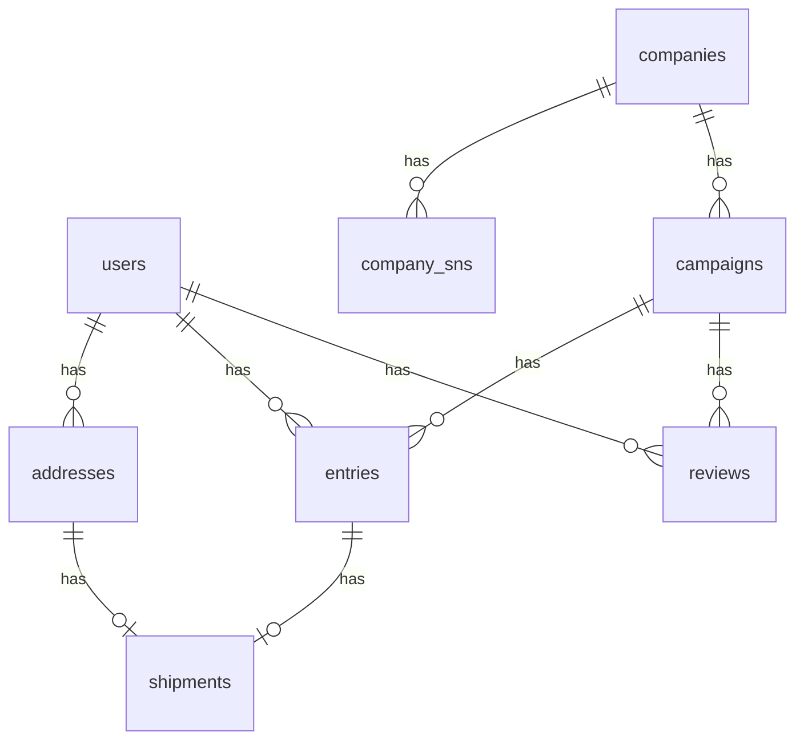

# テーブル設計・ER 図

## テーブル一覧（主要項目のみ）

### users（ユーザー）

- id (PK)
- name
- email
- password_digest
- created_at
- updated_at

### companies（掲出企業）

- id (PK)
- name
- email
- password_digest
- contact_name
- contact_phone
- postal_code
- prefecture
- city
- address1
- address2
- url
- created_at
- updated_at

### company_sns（企業 SNS）

- id (PK)
- company_id (FK)
- sns_type（Enum: twitter, facebook, instagram, tiktok, etc）
- sns_url
- created_at
- updated_at

### addresses（住所）

- id (PK)
- user_id (FK)
- postal_code
- prefecture
- city
- address1
- address2
- phone
- is_default
- created_at
- updated_at

### campaigns（案件）

- id (PK)
- company_id (FK)
- title
- description
- image_url
- start_at
- end_at
- status
- created_at
- updated_at

### entries（応募）

- id (PK)
- user_id (FK)
- campaign_id (FK)
- status（応募/当選/落選など）
- created_at
- updated_at

### reviews（レビュー）

- id (PK)
- user_id (FK)
- campaign_id (FK)
- rating
- comment
- created_at
- updated_at

### shipments（配送）

- id (PK)
- entry_id (FK)
- address_id (FK)
- shipped_at
- status
- created_at
- updated_at

---

## ER 図（Mermaid 記法）

※companies（掲出企業）と company_sns（企業 SNS）は 1 対多リレーションです。
