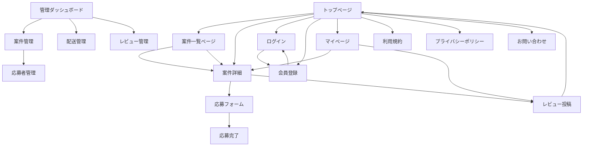

# URL 定義書（画面仕様・エンドポイント一覧）

| 画面名               | URL 例                          | 概要・備考                                                                 |
| -------------------- | ------------------------------- | -------------------------------------------------------------------------- |
| トップページ         | `/`                             | 案件一覧を表示                                                             |
| 案件一覧ページ       | `/campaigns`                    | 案件の全件・カテゴリ別一覧表示                                             |
| 案件詳細             | `/campaigns/[id]`               | 案件の詳細情報・応募ボタン。マイページの「過去に受けた案件」からも遷移可能 |
| 応募フォーム         | `/campaigns/[id]/entry`         | 応募内容確認・送信                                                         |
| 応募完了             | `/campaigns/[id]/entry/done`    | 応募完了メッセージ                                                         |
| マイページ           | `/mypage`                       | 応募履歴・当選履歴・レビュー投稿。過去に受けた案件一覧から案件詳細へ遷移   |
| レビュー投稿         | `/mypage/review/[id]`           | レビュー投稿フォーム。投稿完了後はトップページへ遷移                       |
| 管理ダッシュボード   | `/admin`                        | 管理者用トップ                                                             |
| 案件管理             | `/admin/campaigns`              | 案件の一覧・作成・編集・削除                                               |
| 応募者管理           | `/admin/campaigns/[id]/entries` | 応募者・当選者管理                                                         |
| 配送管理             | `/admin/shipments`              | 配送状況管理                                                               |
| レビュー管理         | `/admin/reviews`                | レビュー一覧・管理                                                         |
| ログイン             | `/login`                        | ログインフォーム                                                           |
| 会員登録             | `/register`                     | 新規会員登録フォーム                                                       |
| 利用規約             | `/terms`                        | 静的ページ                                                                 |
| プライバシーポリシー | `/privacy`                      | 静的ページ                                                                 |
| お問い合わせ         | `/inquiry`                      | お問い合わせフォーム                                                       |

---

# 画面遷移図（テキスト簡易版）

※マイページには「過去に受けた案件一覧」があり、そこから案件詳細へ遷移可能。
※レビュー投稿は「案件詳細」「マイページ」から遷移可能。案件詳細画面でログイン時のみレビュー投稿ボタンを表示。
※レビュー投稿完了後はトップページへ遷移。
※Mermaid 記法で記載しています。VSCode 拡張や Mermaid 対応ビューアで可視化できます。
